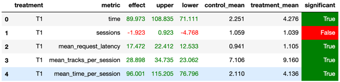

# SATPR Recommender

## Abstract

Больше всего мне приглянулся `Sticky artist`. Он показал себя лучше всего на курсе, перебив даже некоторые нейросетевые
рекоммендеры. Поэтому я решил взять в основу его и попробовать избавиться от недостатков при помощи `Top pop`
рекоммендера, а его в свою очередь избавить от недостатков при помощи `Random` рекоммендера.

## Details

Заметим, что библиотека треков, с которой нам предстоит работать так устроена, что 56% артистов имеют только 1 трек.
Теперь вспомним про недостатки `Sticky artist`:

1. При только 1 треке у артиста мы будем постоянно включать этот трек
2. Треки одного и того же артиста рано или поздно станут надоедать

Попробуем решить эти проблемы: \
Если у артиста только один трек или пользователь прослушал меньше `alpha`% от трека () или если разница между
длительностью продолжительности двух последних прослушанных треков больше чем `epsilon`, то выберем случайный трек из
самых популярных. Назовем такое действие - `jump`. \
Чтобы выбрать один из самых популярных, воспользуемся `Top pop`
рекоммендером. \
Теперь вспомним основную проблему `Top pop` рекоммендера и попробуем её решить. \
Основная проблема заключается в том, что мы "заслушаем" самые популярные треки, тем самым скорее всего убьём сервис
через какое-то время. Чтобы такого не допустить мы будем раз в `beta` `jump`-ов выдавать пользователю случайный трек при
помощи `Random` рекоммендера.

## Results of the AB experiment

В результате A/B эксперимента у меня получилось "обыграть" `Sticky artist` \
